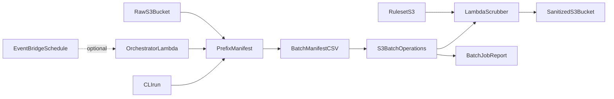

# Architecture

## Overview

1. A **prefix manifest** (CSV of bucket + key) is generated, either by the CLI (`run`) or the scheduled **orchestrator Lambda**, and uploaded to the config bucket.
2. **S3 Batch Operations** reads the manifest and invokes the scrubber **Lambda** once per object.
3. Lambda reads the source object, drops configured columns, writes to the sanitized bucket with the same relative key (optionally under a different prefix).
4. Batch writes a **completion report** listing successes and failures.

The orchestrator and scrubber share **one container image** with different entrypoints (`orchestrator.lambda_handler` vs `handler.lambda_handler`). The manifest/listing logic is shared code (`manifest_core.py` + `run_job.py`) used by both the CLI and the orchestrator, so scheduled and manual runs behave identically. Scheduling is optional and off by default.

## Design constraints

- Processing runs entirely in the **client AWS account** (same region as data).
- **Per-file mapping (default)**: same bucket as source; `sanitized/<full source object key>` via `SOURCE_PREFIX=""` and `DEST_PREFIX=sanitized/`.
- Primary transform: **drop columns** from a versioned ruleset (masking/tokenization can be added later).

## Components

| Component | Responsibility |
|-----------|----------------|
| Lambda container (`scrubber/container`) | Format detection, rules resolution, S3 read/write (scrubber); daily manifest + Batch job creation (orchestrator) |
| Shared run core (`manifest_core.py`, `run_job.py`) | Listing, incremental skip, manifest write, Batch job creation — shared by CLI and orchestrator |
| Ruleset (S3) | Column drop lists per prefix |
| Terraform / CloudFormation | IAM, Lambda, optional buckets, batch role, optional schedule (orchestrator + EventBridge) |
| S3 Batch job (per run) | Fan-out orchestration and reporting |
| Orchestrator + EventBridge (optional) | Daily incremental scrub without manual `run` |

## Performance and cost

- Dominant cost at scale is **per-object S3 GET/PUT** plus **Batch per-object fee**, not Lambda CPU (for simple column drops).
- Tune Lambda **reserved concurrency** to avoid S3/KMS throttling during large backfills.
- Example: ~10M files / ~2TB → on the order of **~$90** compute+requests (region-dependent); storage and KMS are additional.

## Security

- Sanitized bucket should be **write-only from the scrubber** for raw paths; no raw data in dest.
- Use SSE-KMS when required; document KMS request volume for high object counts.
- Least-privilege IAM scoped to source/dest prefixes and ruleset object.
